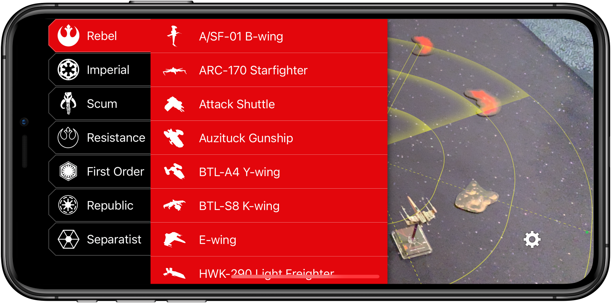

**DialVision** is an iOS app that lets you preview maneuvers for the X-Wing Miniatures Game directly in augmented reality on your iOS device.

See which maneuver to use to avoid collisions. Visualize a ship's firing range and where it will be positioned after executing the selected maneuver, boost, barrel roll, SLAM, or decloak.

Select which ship you're flying and the maneuver or action you want to preview.

---

#### Disclaimer:

X-Wing: The Miniatures Game is a trademark of [Fantasy Flight Games](http://www.fantasyflightgames.com/).

DialVision is the work of a fan, and is not endorsed by Fantasy Flight Games, Lucasfilm Ltd. or Twentieth Century Fox and is intended for entertainment and information purposes only.

The names and icons of Star Wars characters, vehicles and any other Star Wars related items are registered trademarks and/or copyrights of Lucasfilm Ltd, or their respective trademark and copyright holders.

For more information on X-Wing: The Miniatures Game please visit [http://www.fantasyflightgames.com/](http://www.fantasyflightgames.com/).

---

[Privacy Policy](privacy-policy.md) | Copyright 2020 Melissa Ludowise