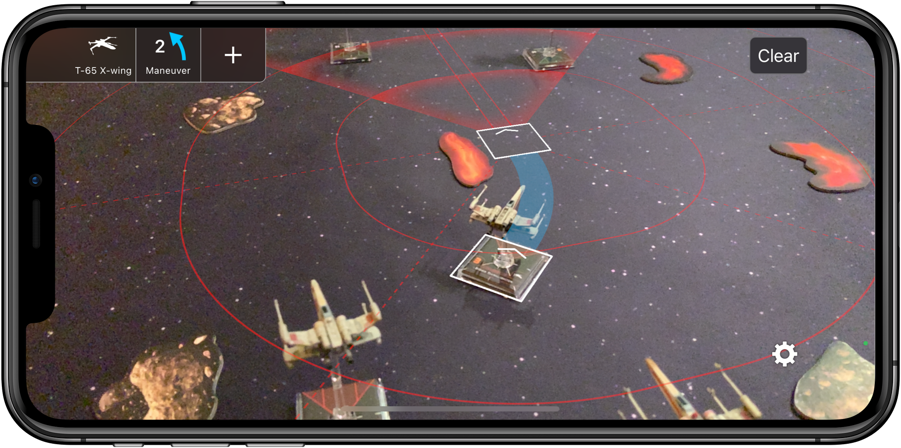

X-Wing Assist is an iOS app that lets you preview maneuvers for the X-Wing Miniatures Game directly in augmented reality on your iOS device.

Visualize a ship's firing range and where it will be positioned after executing the selected maneuver, boost, barrel roll, or SLAM.

[//]: # (Tap on the screen to identify your ship's position in augmented reality, select which ship you're previewing in the menu, then select the maneuver and action you wish to preview. Determine what positions will be within firing range and which maneuvers will avoid obstacle collisions.)

# Become a Beta Tester

If you have an iOS device that meets all of the requirements below, you can sign up below to become a Beta Tester. Provide your email address and you will be contacted with instructions to download a Beta version of the app.

[Sign Up](https://goo.gl/forms/6Koja2biJ3sND8Vd2)

## Requirements
X-Wing Assist uses Apple's latest ARKit technology which requires [iOS 11 Beta](https://beta.apple.com/sp/betaprogram/) and one of the following iOS devices:
- iPhone SE
- iPhone 6s
- iPhone 6s Plus
- iPhone 7
- iPhone 7 Plus
- iPad Pro (All three variants and models)
- New 9.7-inch iPad (2017)

---

#### Disclaimer:

X-Wing: The Miniatures Game is a trademark of [Fantasy Flight Games](http://www.fantasyflightgames.com/).

X-Wing Assist is the work of a fan, and is not endorsed by Fantasy Flight Games, Lucasfilm Ltd. or Twentieth Century Fox and is intended for entertainment and information purposes only.

The names and icons of Star Wars characters, vehicles and any other Star Wars related items are registered trademarks and/or copyrights of Lucasfilm Ltd, or their respective trademark and copyright holders.

For more information on X-Wing: The Miniatures Game please visit [http://www.fantasyflightgames.com/](http://www.fantasyflightgames.com/).
